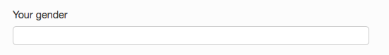

# Practices

### Collect all user data in changeable, free-form text fields
Limited lists of values for fields like name, gender, ethnicity and more
don't often work in real
life. [W3C](https://www.w3.org/International/questions/qa-personal-names)
has a good write-up making the case for why names don't fit the schema
of first name-last name for many people. One alternative they suggest
is to ask for the full name in one text field, then ask how your users
would like to you to call them in another field:

Likewise with gender and
ethnicity, these are identities that people choose for ourselves, and
we can change the way we think about them over the course of our
lives.

For more info, read this great [Model View
Culture](https://modelviewculture.com/pieces/the-argument-for-free-form-input)
piece.

### Establish guidelines for discourse on-line
See the [Contributor Covenant](http://contributor-covenant.org), [The
Universal Rules of Civilized
Discourse](http://blog.discourse.org/2013/03/the-universal-rules-of-civilized-discourse/),
and a good example of a Code of Conduct by [Hypatia Software
Organization](http://hypatiasoftware.org/code-of-conduct/).

### Be clear on why we're collecting each piece of data and what we’re doing with it

### Non-gendered, non-raced user icons
Some good examples are Twitter's egg:

iPhone's initials icons:

Slack's hash default user icon--a close-up of the center of their icon done in different colors:

Flickr's camera default user icon--an illustration of a different type
of camera done in different colors:

Wordpress's default user icon--a symetrical, geometrical pattern of
polygons done in a different bright color for each user:

### Don't stage false diverse photographs

Inspiration porn of images of people with disabilities in museums also
falls into this category.

### Using analytics: Decide, act, measure vs. measure, decide, act

### Consider and critique modes of communication: face-to-face, e-mail

### Implement Universal Design and Learning

# Exercises

- Critique your organization’s inclusion work based on: what they do, what they think they do, and what they won't do
- Take 5 minutes at the beginning of a design phase to consider how to make something anti-oppressive. Here are some things to think about:
  - Are your sign-up forms respectful of people outside the gender binary?
  - Do icons, photos, etc. assume things about gender or race of users?
  - Is the project accessible for people with sensory impairments?
  - Does the writing (especially in curatorial content) use language that visitors might find alienating/off-putting?
  - What data are you collecting? Do you really need to be collecting it? Does the project respect the privacy of users (ex: online visitors in another country looking at content that might be considered restricted in their country of origin - gay rights, political content, etc).
  - Who’s not here? Why?

# Broader ideas
- Create relationships and co-create with people of color
- Share institutional power
- People of color are going to create content more interesting to people of color
- GET OUT of the museum
- Join organizations that are advocating for social justice issues or movement
- Create work based on the needs of people
- “Design for your community, not for the world”
- Invest time in communities that are being affected by the presence of museum, of histories hidden in the archive, or not told in exhibitions
- Identify reusable wins
- Find out how to connect your work with movements
- Use money to subsidize programming
- Leadership must make inclusion a priority and lens through which all work is approached.
